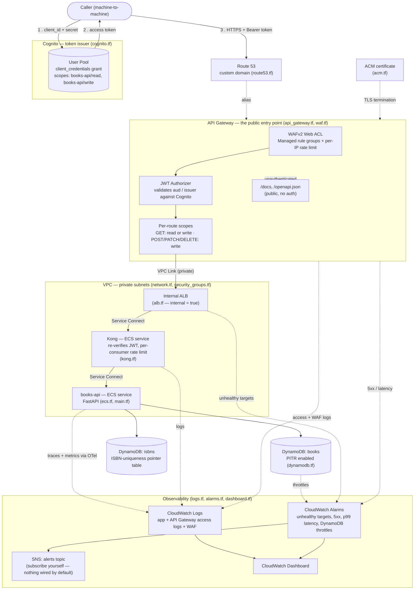

# Architecture

<!--
  GENERATED FILE — do not edit by hand.
  Produced by scripts/generate_architecture_diagram.py; run
  `make architecture-diagram` (or the command above) to regenerate after
  changing the diagram there. Edits made directly to this file are
  overwritten the next time it runs.
-->

Machine-to-machine REST API on ECS Fargate, fronted by API Gateway (public
edge: TLS, WAF, JWT auth) with Kong behind it for the one thing API
Gateway's HTTP API generation can't do natively — per-consumer rate
limiting. See [`terraform/README.md`](terraform/README.md) for the full
request-path writeup and the reasoning behind each hop, and
[`CLAUDE.md`](CLAUDE.md) for the application-level architecture
(routers → repository → DynamoDB).

